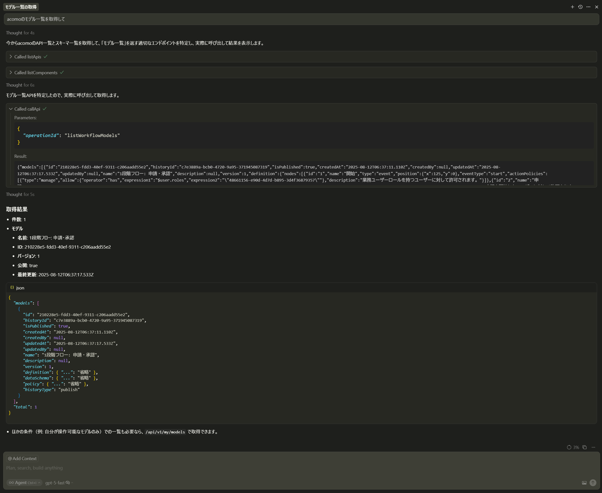
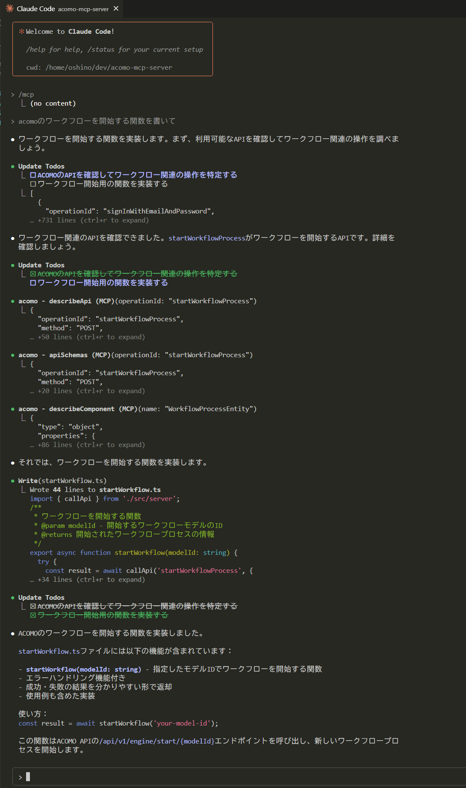

# acomo-mcp-server

acomo API をツールから扱えるようにする MCP (Model Context Protocol) サーバです。stdio トランスポートで動作します。OpenAPI に基づく API 一覧やスキーマ参照、リクエスト雛形生成、API 呼び出し（問い合わせ）も行えます。

## このサーバが提供するツールの種類

acomo MCP は、用途に応じて次の2種類のツールを提供します。

- OpenAPI仕様に基づくAPIドキュメント応答ツール（仕様の検索・要約・雛形生成・Q&A／APIコールは行わない）
  - `listApis`, `describeApi`, `apiSchemas`, `generateApiRequestTemplate`, `listComponents`, `describeComponent`
  - 認証や追加設定は不要です。

- OpenAPI仕様に基づくAPIコールツール（API を実行）
  - `callApi`
  - 認証のため環境変数 `ACOMO_TENANT_ID` と `ACOMO_ACCESS_TOKEN` の設定が必要です。

## MCP クライアント設定例（推奨: Docker）

以下は `mcpServers` 設定です（API仕様ドキュメント応答用途の例）。

```json
{
  "mcpServers": {
    "acomo": {
      "command": "docker",
      "args": [
        "run", "-i", "--rm",
        "ghcr.io/progress-all/acomo-mcp-server:latest"
      ]
    }
  }
}
```

### latest イメージの更新（Docker）

`latest` タグのイメージを使っている場合、更新は次のコマンドで行えます。

```bash
docker pull ghcr.io/progress-all/acomo-mcp-server:latest
```

次回の起動（`docker run`）から新しいイメージが使われます。固定タグ（例: `vX.Y.Z`）を使っている場合は、そのタグを指定して pull してください。

### OpenAPI仕様に基づくAPIコールに必要な追加環境変数（`callApi`）

APIコールツールを使う場合は、次の環境変数が必要です。

- `ACOMO_TENANT_ID`
- `ACOMO_ACCESS_TOKEN`

Docker の設定例（上の応答用途の例に追記する形）:

```json
{
  "mcpServers": {
    "acomo": {
      "command": "docker",
      "args": [
        "run", "-i", "--rm",
        "-e", "ACOMO_TENANT_ID=<tenant-id>",
        "-e", "ACOMO_ACCESS_TOKEN=<access-token>",
        "ghcr.io/progress-all/acomo-mcp-server:latest"
      ]
    }
  }
}
```

## 代替: GitHub からクローンして実行する場合（APIコール例）

Node.js 18+（推奨: 20+）

1. リポジトリを取得してビルドします。

   ```bash
   git clone https://github.com/progress-all/acomo-mcp-server.git
   cd acomo-mcp-server
   npm ci
   npm run build
   ```

2. `mcpServers` 設定（Node 実行・OpenAPI仕様に基づくAPIコールの例）

   ```json
   {
     "mcpServers": {
       "acomo": {
         "command": "node",
         "args": ["/absolute/path/to/repo/dist/server.js"],
           "env": {
             "ACOMO_OPENAPI_PATH": "/absolute/path/to/repo/openapi.json",
             "ACOMO_TENANT_ID": "<tenant-id>",
             "ACOMO_ACCESS_TOKEN": "<access-token>"
           }
       }
     }
   }
   ```

## 提供ツール（Tools）

- `health`: ヘルスチェック
- `listApis`: OpenAPI の API 一覧
- `describeApi`: 指定 `operationId` の詳細
- `apiSchemas`: `parameters` / `requestBody` / `responses` の抜粋
- `generateApiRequestTemplate`: パラメータ・ボディの雛形生成
- `listComponents`: `components.schemas` の一覧
- `describeComponent`: 指定スキーマの JSON Schema
- `callApi`: 指定 `operationId` で API 呼び出し

## 提供リソース（Resources）

- `openapi://acomo`: OpenAPI 仕様全体（application/json）
- `guide://auth`: 認証・ヘッダ設定の簡易ガイド（text/markdown）

## 使い方の例

acomo APIの詳細を知らなくとも自然文で問い合わせできます。以下は Cursorで`acomoのモデル一覧を取得して`と実行した場合の例です。これは実際にacomoのAPIコールまで実行しています。



開発中にacomo APIの詳細をAIに教えながらコーディングする場合はAPIコールなしでも使えます。以下は、Claude Codeで`acomoのワークフローを開始する関数を書いて`と実行した場合の例です。



補足: 表示される応答や生成コードの品質は、LLM のモデル特性やプロンプト、提供したコンテキストにより最適化されます。acomo MCP は OpenAPI 仕様の参照と安全な API 実行を担う標準インターフェースであり、各 LLM の強みを最大限に活かせるよう設計されています。

## ライセンス

MIT License. 詳細は `LICENSE` を参照してください。

## 環境変数

| 変数名 | 必須/任意 | 既定値 | 用途/期待される値 |
| --- | --- | --- | --- |
| `ACOMO_TENANT_ID` | APIコール時に必須 | なし | acomo テナントID。`callApi` で `x-tenant-id` ヘッダとして送信されます。例: `acomo-example` |
| `ACOMO_ACCESS_TOKEN` | APIコール時に必須 | なし | Bearer アクセストークン。`callApi` 時に `Authorization: Bearer <token>` を送信します。 |
| `ACOMO_API_BASE` | 任意 | `https://acomo.app` | API のベースURL。通常は変更不要。自前環境やローカル検証時のみ上書きしてください。例: `http://localhost:3000` |
| `ACOMO_OPENAPI_PATH` | 任意 | リポジトリ同梱の `openapi.json` | 読み込む OpenAPI 仕様ファイルのパス。通常は変更不要。 |
| `ACOMO_REQUEST_TIMEOUT_MS` | 任意 | `30000` | リクエストタイムアウト（ミリ秒）。 |
